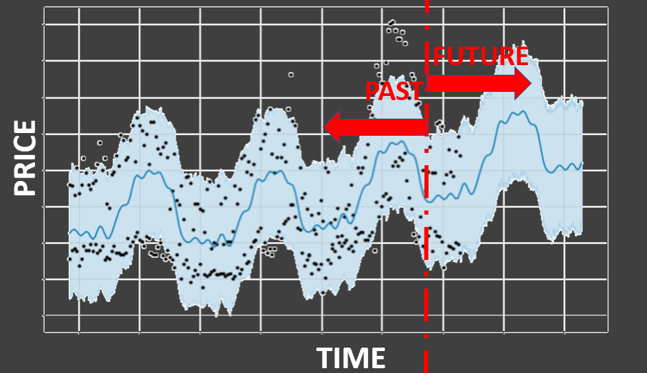

# Project Description:**

This Machine Learning project aims to develop a predictive model for forecasting future avocado prices in the US using historical time series data. Leveraging the Facebook Prophet algorithm, an open-source tool for time series forecasting, the project will explore both univariate and multivariate approaches to enhance prediction accuracy with multiple explanatory variables. The comparison between these approaches will provide insights into the effectiveness of incorporating additional variables in price prediction models.

- [Facebook Prophet](https://facebook.github.io/prophet/) is an open source tool used for time serie forcasting
- We will be comparing a univariate to a multi-variate approach for price prediction.
- The expected outcome will look like this :

## The description of the dataset :

- Date: The date of the observation
- AveragePrice: the average price of a single avocado
- type: conventional or organic
- year: the year
- Region: the city or region of the observation
- Total Volume: Total number of avocados sold
- 4046: Total number of avocados with PLU 4046 sold
- 4225: Total number of avocados with PLU 4225 sold
- 4770: Total number of avocados with PLU 4770 sold
